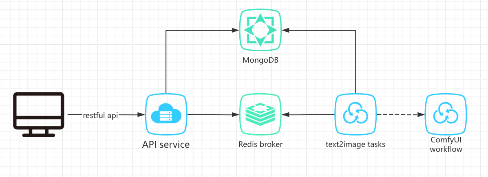

## 0x01 基本架构



## 0x02 已实现
* 环境搭建与验证
1. 在本地成功安装 ComfyUI 环境，截取了两个 demo 图，在 comfyui 目录下。
* 接口服务开发
  1. 基于 Python Fastapi, celery, Redis broker 实现
  2. 提供异步的文生图接口
  3. 支持任务状态查询
  4. 任务取消接口
  5. 日志记录，日志会写在 src/log/app.log 文件中

## 0x03 部分实现
  1. text2image 可异步处理任务，但没有实现调用 ComfyUI workflow
  2. text2image 中可模拟当前服务 GPU 是否满足条件，如不满足条件，进行 task 重试。

## 0x04 未实现
  1. 自己电脑相应的资源环境，实际上可以使用自建 K8S 集群或者云服务商的集群来实现多机器、多 GPU 部署
 


## 0x05 docker 镜像构建及启动服务（在本机 M4 Macos 测试通过)
* docker 镜像构建
```shell
docker build -t task_app:v1 -f docker/Dockerfile .
```

* 启动服务: mysql, redis, api, fake text2images task
```shell
docker compose -f docker/docker-compose.yml up
```
